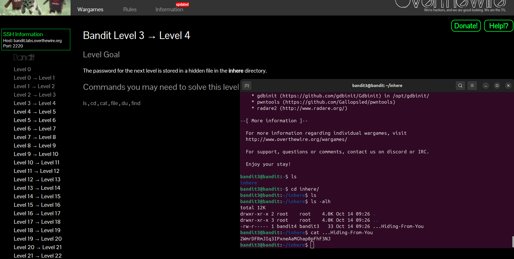

# Bandit Level 3 → Level 4

### Goal
The password for the next level is stored in a hidden file in the `inhere` directory.

### Solution
Hidden files in Linux start with a dot (`.`). To see them, you need the `-a` flag with the `ls` command.

1. **Go to the directory:**
```bash
cd inhere
```
2. List all files (including hidden ones):  
```bash
ls -a
```
3.Read the hidden file:  
```bash
cat .hidden
```
Password for Level 4  
2WmrDFRmJIq3IPxneAaMGhap0pFhF3NJ


### Screenshot



