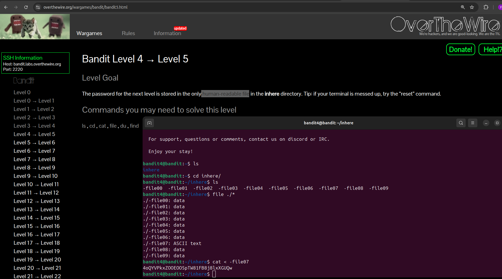

# Bandit Level 4 → Level 5

### Goal
The password for the next level is stored in the only human-readable file in the `inhere` directory.

### Solution
Inside the `inhere` directory, there are several files starting with a dash `-`. We need to identify which one contains text.

1. **Navigate to the directory:**
```bash
cd inhere
```
2. Identify the file type of all files:  
```bash
file ./*
```
Observation: All files are listed as "data" except for ./-file07, which is "ASCII text".  
3. Read the password from the identified file:  
```bash
cat < -file07
```
Password for Level 5  
4oQYVPkxZOOEOO5pTW81FB8j8lxXGUQw  

### Screenshot

