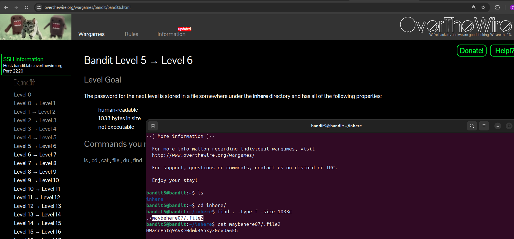

# Bandit Level 5 → Level 6

### Goal
The password for the next level is stored in a file somewhere under the `inhere` directory and has all of the following properties:
- Human-readable
- 1033 bytes in size
- Not executable

### Solution
Since there are many directories and files, we use the `find` command to filter by the specific size (1033 bytes).

1. **Navigate to the directory:**
```bash
cd inhere
```
2.Find the file with the exact size:
```bash
find . -type f -size 1033c
```
Note: 1033c specifies the size in bytes.  
3.Read the password from the located file:
```bash
cat ./maybehere07/.file2
```
Password for Level 6  
HWasnPhtq9AVKe0dmk45nxy20cvUa6EG


### Screenshot

